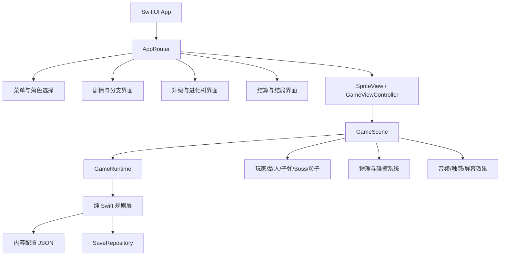

# 《星火燎原》iOS 游戏架构文档

> **剧情状态迁移说明**：本文的 Swift 示例仍含早期 `StoryBranch.rebel/empire` 和“第二章唯一分支入口”。当前原型已改为第 09 隔离关口路线模型；正式客户端应以 `RouteID`（`sealGate`、`breakBlockade`、`deepRock`）替换该示例，并保留 B 区仅写入证据的规则。人物与世界观以 `星火燎原-多视角剧情小说.md` 和 `剧情设计文档.md` 为准。

## 1. 架构结论

目标平台为 iOS 17+，并锁定纯横屏；iPhone 和 iPad 使用同一套横屏信息布局。推荐采用 `SwiftUI + SpriteKit + Swift Concurrency + Codable/SwiftData` 的分层架构：

- SwiftUI：菜单、角色选择、剧情、升级、进化树、设置和结算页面。
- SpriteKit：战斗场景、玩家、敌人、子弹、碰撞、粒子、背景和 Boss 阶段。
- 纯 Swift Domain 层：游戏规则、章节状态、分支、升级、进化树和存档模型。
- 资源与配置层：通过 Codable JSON/Plist 驱动角色、敌人、关卡、对话和升级，减少硬编码。

不建议把现有 `fb.html` 的 Canvas 代码逐行翻译成 Swift。网页原型适合验证手感，但 iOS 版本需要可测试的规则层、可配置内容和可恢复的状态机。首版不引入网络服务、账号、内购或局外永久成长系统。

## 2. 总体结构



## 3. 推荐目录结构

```text
Starfire/
├── App/
│   ├── StarfireApp.swift
│   ├── AppRouter.swift
│   └── AppEnvironment.swift
├── Presentation/
│   ├── Menu/
│   ├── PilotSelection/
│   ├── Dialogue/
│   ├── Upgrade/
│   ├── EvolutionTree/
│   ├── Result/
│   └── Settings/
├── Game/
│   ├── GameView.swift
│   ├── GameViewModel.swift
│   ├── GameScene.swift
│   ├── Entities/
│   ├── Systems/
│   ├── Bosses/
│   └── Effects/
├── Domain/
│   ├── GameState.swift
│   ├── Chapter.swift
│   ├── Branch.swift
│   ├── Pilot.swift
│   ├── Upgrade.swift
│   ├── RogueItem.swift
│   ├── ShipUpgrade.swift
│   ├── Salvage.swift
│   ├── EvolutionNode.swift
│   ├── Dialogue.swift
│   └── CombatRules.swift
├── Data/
│   ├── ContentRepository.swift
│   ├── SaveRepository.swift
│   └── Content/*.json
├── Resources/
│   ├── Assets.xcassets/
│   ├── TextureAtlases/
│   ├── Audio/
│   ├── Fonts/
│   └── Localizable.xcstrings
├── Services/
│   ├── AudioService.swift
│   ├── HapticsService.swift
│   ├── AnalyticsService.swift
│   └── RandomSource.swift
└── Tests/
    ├── DomainTests/
    ├── ContentTests/
    └── GameFlowTests/
```

## 4. 状态模型

### 4.1 应用状态

```swift
enum AppRoute {
    case menu
    case pilotSelection
    case story(DialogueScene)
    case game(GameSession)
    case upgrade(GameSession)
    case evolutionTree
    case result(GameResult)
    case settings
}
```

`AppRouter` 只负责页面导航，不负责修改战斗规则。规则变化通过 `GameSession` 和领域服务完成。

### 4.2 战斗状态

```swift
enum CombatPhase {
    case briefing
    case playing
    case paused
    case bossIntro
    case boss
    case dialogue
    case upgrade
    case defeat
    case victory
}
```

状态转换必须集中管理，禁止由多个 SwiftUI View 或 SpriteKit 节点直接互相修改状态：

```text
briefing -> playing -> upgrade -> playing
playing -> bossIntro -> boss -> dialogue/upgrade
playing -> defeat
boss -> victory
dialogue -> playing | branchChoice | nextChapter
```

### 4.3 分支状态

```swift
enum StoryBranch: String, Codable {
    case undecided
    case rebel
    case empire
}

struct StoryFlags: Codable {
    var branch: StoryBranch = .undecided
    var selectedPilot: PilotID
    var rescuedRefugees: Bool = false
    var executedPurification: Bool = false
    var dataFragments: Set<String> = []
    var defeatedBossIDs: Set<String> = []
}
```

第二章选择是唯一主分支入口。后续章节由 `StoryFlags.branch` 选择内容包，避免在各个系统中散落 `if empire` 判断。分支只作用于当前战役，战役结束后玩家可以重新选择驾驶员和线路；已达成结局和已见内容单独写入永久本地记录。

## 5. SpriteKit 战斗架构

### 5.1 GameScene 职责

`GameScene` 只负责：

- 创建和销毁场景节点。
- 将触摸位置转换为世界坐标。
- 驱动固定时间步的战斗更新。
- 注册 SpriteKit 物理体和碰撞类别。
- 将游戏事件发送给 `GameViewModel` 或事件总线。

它不直接决定章节分支、结局或升级内容。

### 5.2 GameRuntime 职责

`GameRuntime` 是纯规则协调器，负责：

- 当前章节、波次和战斗阶段。
- 玩家属性、敌人生成、投射物和掉落物的规则。
- 伤害、碰撞结果、经验和升级触发。
- Boss 阶段条件和剧情触发条件。
- 随机源和重放所需的随机种子。

### 5.3 系统拆分

```text
InputSystem          接收触摸目标位置和主动技能输入
SpawnSystem          按章节和波次生成敌人、掉落物和弹幕
WeaponSystem         自动射击、弹道、冷却、伤害和穿透
CollisionSystem       处理玩家、敌人、子弹、掉落物碰撞
DamageSystem          统一计算护甲、护盾、无敌和死亡
ProgressionSystem     经验、升级三选一、进化节点和构筑
BossSystem            Boss 阶段、弱点、剧情击败和胜负条件
PresentationSystem    粒子、闪光、镜头震动、音效和触感事件
```

## 6. 游戏对象设计

建议使用 SpriteKit 节点承载渲染和物理，使用领域值类型承载规则数据：

```swift
struct CombatStats {
    var maxArmor: Double
    var moveSpeed: Double
    var fireInterval: TimeInterval
    var projectileDamage: Double
    var projectileCount: Int
    var projectileSpeed: Double
}

struct UpgradeLoadout: Codable {
    var modules: [UpgradeID] = []
    var unlockedNodes: Set<EvolutionNodeID> = []
    var empireCount: Int = 0
    var rebelCount: Int = 0
    var rogueItems: [RogueItemInstance] = []
    var shipUpgrades: [ShipUpgradeID] = []
    var salvage: Int = 0
    var routeSpecializations: Set<RouteID> = []
}
```

核心对象：

- `PlayerEntity`：位置、目标位置、驾驶员 ID、当前装甲、技能冷却和构筑。
- `EnemyEntity`：敌人类型、生命、速度、攻击模式、阵营和掉落表。
- `ProjectileEntity`：来源、速度、伤害、穿透、命中集合和阵营。
- `BossEntity`：阶段、弱点部位、护甲、弹幕模式和剧情触发器。
- `PickupEntity`：经验、修复、数据碎片或临时增益。

## 7. 角色能力架构

不要为三个角色复制三套战斗循环。使用协议和能力组件组合：

```swift
protocol PilotAbility {
    func onFrame(context: inout AbilityContext)
    func onDamage(_ event: DamageEvent, context: inout AbilityContext)
    func onProjectileHit(_ event: HitEvent, context: inout AbilityContext)
}
```

- 每名角色拥有一个由 `ActiveAbility` 实现的主动技能，并通过输入系统触发、由技能冷却限制。
- Alice 组件：主动技能为短时间无敌并无视碰撞体积，另含擦弹检测、速度增益和濒死过载。
- Bob 组件：主动技能为全屏跟踪导弹，另含静止计时、敌方弹幕减速和目标骇入。
- Charlie 组件：主动技能为保护罩加激光齐射，另含结构疲劳、残骸收集和重型弹药。

能力通过事件响应，而不是直接依赖具体 SpriteKit 节点，便于单元测试和未来增加角色。

## 8. Roguelite 架构

### 8.1 内容模型

升级和进化树由 JSON 驱动，示例：

```json
{
  "id": "alice_redshift_01",
  "pilot": "alice",
  "faction": "rebel",
  "tree": "redshift",
  "tier": 1,
  "name": "热寂波动",
  "description": "擦弹判定范围扩大，并恢复少量能量",
  "prerequisites": [],
  "effects": [{ "type": "grazeRadiusMultiplier", "value": 1.3 }]
}
```

领域层将 JSON 解码为 `UpgradeDefinition`，由 `UpgradeResolver` 将效果应用到 `CombatStats` 和 `UpgradeLoadout`。UI 不直接修改数值。

### 8.2 技术摩擦

技术摩擦使用显式规则表：

```swift
struct SynergyRule: Codable {
    let requiredUpgradeIDs: [UpgradeID]
    let result: UpgradeEffect
}
```

初期只支持两模块组合，满足条件时由 `SynergyResolver` 发出事件。这样可以把内容扩展限制在数据文件，不改战斗主循环。

### 8.3 暂停和升级

升级触发流程：

```text
获得经验 -> 达到阈值 -> CombatPhase.upgrade
         -> GameRuntime 生成候选池
         -> SwiftUI 展示 3 个候选
         -> 用户选择 -> UpgradeResolver 应用
         -> 恢复 SpriteKit 场景
```

升级界面暂停规则更新，但允许渲染背景和冻结的场景画面。恢复时使用时间戳校正，不能把暂停期间的时间算入敌人生成和技能冷却。

### 8.4 Rogue 与章节整备

`RogueItemInstance`、`SalvageSystem` 和 `ShipUpgradeSystem` 共同实现章节间成长：

- 战斗中由 `DropSystem` 生成 Rogue 物品，写入当前 `GameSession` 的货舱。
- 章节 Boss 结束后，SwiftUI 的 `CargoView` 负责锁定、替换和变卖物品。
- `SalvageSystem` 根据品质、等级和路线计算废料；确认变卖后不可撤销。
- `ShipUpgradeSystem` 使用废料生成 3 个升级候选，最多购买 2 项。
- Rogue 武器与飞船升级只属于当前战役，永久存档不记录可带入下一局的战斗数值。

### 8.5 内容配置

Rogue 物品、变卖规则和三名角色的飞船路线由配置文件驱动：

```text
Content/
├── rogue_items.json
├── salvage_rules.json
├── ship_upgrades_alice.json
├── ship_upgrades_bob.json
└── ship_upgrades_charlie.json
```

剧情文本按稳定 ID 和角色/线路维度组织，建议增加：

```text
Content/Dialogue/
├── story_zh-Hans.json
├── story_en.json
├── boss_zh-Hans.json
├── loot_zh-Hans.json
└── fragments_zh-Hans.json
```

台词解析参数包含 `textID`、`pilot`、`rival`、`branch` 和 `language`。缺失角色台词时，开发环境必须报出缺失 ID，禁止静默复用另一个驾驶员的台词。

每个物品拥有 `slotType`、`rarity`、`faction`、`levelCap`、`effectsByLevel` 和 `sellValue`。每个飞船升级拥有 `pilot`、`route`、`cost`、`prerequisites` 和 `effects`。UI 只展示配置，领域层负责校验前置条件和应用效果。

难度由 `DifficultyDefinition` 配置驱动，至少包含 `minionCountMultiplier`、`spawnIntervalMultiplier`、`minionHealthMultiplier`、`minionDamageMultiplier`、`bossHealthMultiplier`、`bossDamageMultiplier`、`bossBulletDensityMultiplier` 和 `rogueDropTarget`。标准难度为 1.0 基线，故事和灾厄只覆盖配置，不在战斗代码中写分支。

### 8.6 路线专精

`BuildResolver` 每次构筑变化后统计各 `RouteID` 的装备数量。某条路线达到 3 件不同 Rogue 物品时写入 `routeSpecializations`，并启用该路线的专精效果。不同路线可以同时生效；专精奖励只在当前战役有效。

## 9. Boss 弱点与 QTE 架构

`BossDefinition` 配置弱点部位、暴露条件、QTE 类型和成功/失败结果。`BossSystem` 只负责判定条件，`QTEViewModel` 负责显示短时输入界面，结果通过领域事件返回：

```swift
struct BossWeakPoint: Codable {
    let id: String
    let exposedBy: [WeakPointTrigger]
    let qte: QTEConfiguration
}

struct QTEConfiguration: Codable {
    let input: QTEInput
    let duration: TimeInterval
    let successEffect: [GameEffect]
    let failureEffect: [GameEffect]
}
```

QTE 持续 1 至 2 秒，最多连续 3 次。成功触发破防、高额伤害或额外掉落；失败触发反击但不能直接造成必死伤害。Alice、Bob、Charlie 通过角色配置调整窗口长度、提示提前量和失败惩罚。

## 10. 存档点架构

`SaveRepository` 支持两类写入：

- 自动存档：章节开始和章节结束整备完成后执行。
- 手动存档：暂停菜单随时可执行，包括战斗进行中；保存完整运行时状态，避免读档后重新随机掉落和 QTE。

存档快照必须包含 `GameSession` 的章节、分支、角色、难度、HP、Rogue 货舱、物品等级、废料、飞船升级、专精路线、随机种子、敌人波次、掉落队列、Boss 阶段和 QTE 状态。读取快照后由 `RandomSource` 和运行时快照恢复相同的掉落、敌人波次和 QTE 结果。

## 11. 剧情内容架构

### 9.1 对话模型

```swift
struct DialogueLine: Codable, Identifiable {
    let id: String
    let speaker: SpeakerID
    let textByPilot: [PilotID: String]?
    let text: String?
    let blocking: Bool
    let nextID: String?
}
```

内容文件按章节和线路组织：

```text
Content/
├── story_common.json
├── chapter_01.json
├── chapter_02_choice.json
├── chapter_03_rebel.json
├── chapter_03_empire.json
├── chapter_final_rebel.json
└── chapter_final_empire.json
```

文本资源按语言拆分或使用语言键索引，首版提供 `zh-Hans` 和 `en`。语言切换由 `LocalizationService` 管理，领域层只保存文本 ID，不保存已经渲染的语言字符串。

### 9.2 分支解析

`StoryDirector` 根据 `StoryFlags` 选择下一个章节、Boss 身份和对话节点。玩家选择一名驾驶员后，未被选择的角色可被章节配置指定为叛军线第三章和最终章的 Boss。分支规则应可测试：同一组 flags 必须稳定得到同一内容，不允许 UI 层自行推断。

## 12. 永久存档架构

```swift
struct SaveData: Codable {
    let schemaVersion: Int
    var settings: SettingsData
    var unlockedPilots: Set<PilotID>
    var unlockedEvolutionNodes: Set<EvolutionNodeID>
    var seenDialogueIDs: Set<String>
    var achievedEndings: Set<EndingID>
    var resumeSession: ResumeSession?
}
```

- `SaveRepository` 提供原子写入和读取。
- 写入先保存临时文件，再替换正式文件，避免强制退出导致半文件。
- 每次启动验证 schema 版本并执行迁移。
- `resumeSession` 可选；玩家主动结束一局时清除。
- 永久记录只用于结局/文本回顾、设置和分支体验统计，不提供局外战斗数值加成。
- 首版不包含角色配音；`AudioService` 只管理背景音乐、射击/爆炸音效和通讯提示音。

## 13. 事件与表现层

规则层发出领域事件，表现层订阅：

```swift
enum GameEvent {
    case projectileFired
    case enemyDestroyed(position: CGPoint)
    case playerDamaged(amount: Double)
    case bossPhaseChanged(String)
    case dialogueTriggered(String)
    case upgradeAvailable
    case endingReached(EndingID)
}
```

事件消费者包括：

- `AudioService`：音效和音乐切换。
- `HapticsService`：受击、爆炸、升级和选择反馈。
- `ScreenEffects`：镜头震动、闪屏、CRT/扫描线效果。
- `GameViewModel`：HUD、对话和页面状态更新。

这样可以避免在碰撞代码中直接播放声音或修改 SwiftUI 状态。

## 14. 性能与稳定性

- SpriteKit 场景使用对象池复用子弹、粒子和常见敌人节点。
- 每帧更新只遍历活动实体；死亡实体立即回收，不在数组中长期保留。
- 碰撞使用类别位掩码，并优先使用半径/包围盒粗检测，再进行精确检测。
- 控制屏幕同时存在的子弹、粒子和敌人数，超限时采用回收或降级特效。
- 逻辑更新与渲染解耦，关键规则使用固定时间步或基于 `deltaTime` 的稳定计算。
- 使用 Instruments 检查 CPU、内存、SpriteKit 节点数量和音频资源。
- 目标：主流 iPhone 在正常战斗中稳定 60 FPS；低端设备可切换粒子质量。

## 15. 测试策略

### 13.1 单元测试

- 分支选择映射到正确章节和结局。
- 升级前置条件、效果叠加和技术摩擦规则。
- Alice/Bob/Charlie 的核心能力触发条件。
- 伤害、护盾、无敌、死亡和 Boss 阶段转换。
- 存档编码、解码和版本迁移。

### 13.2 集成测试

- 从角色选择开始，完成一条线路并验证结局。
- 升级暂停/恢复后，敌人和技能计时不跳变。
- 强制退出后恢复当前章节和分支。
- 触摸输入在不同 iPhone 尺寸下映射正确。

### 13.3 手工 QA

- 横屏锁定、刘海/安全区域、低电量模式和后台恢复。
- 关闭音效、音乐、触感和高特效后的完整游玩。
- 快速连续点击对话、升级和重启按钮，不得重复推进或重复结算。
- 两条剧情线路各至少完整通关一次。

## 16. 从 HTML 原型迁移的映射

| `fb.html` 原型 | iOS 目标实现 |
| --- | --- |
| Canvas 绘制 | SpriteKit `SKScene` 和 `SKNode` |
| `requestAnimationFrame` | SpriteKit `update(_:)` |
| 鼠标/触摸目标点 | `touchesMoved` 或 SwiftUI 手势转世界坐标 |
| JS 类 `Player/Enemy/Proj` | 领域模型 + SpriteKit 实体节点 |
| DOM HUD | SwiftUI HUD overlay |
| `triggerUpgrade()` | `GameRuntime` 事件 + SwiftUI UpgradeView |
| `state` 字符串 | 类型安全的 `CombatPhase` |
| JS 数组实体 | EntityStore/对象池 |
| 硬编码 `UPGRADES` | Codable 内容配置和 `UpgradeRepository` |

原型中存在乱码文本、依赖 Google Fonts、全局 JS 状态、数组遍历删除实体和大量硬编码内容。迁移时应把这些问题作为重构目标处理，而不是带入正式工程。正式 iOS 包必须内置字体和 2D 资源，离线状态下可完整运行。

资源格式、命名规则、源文件与运行时文件的分离方式见 [美术素材与项目目录规划](美术素材与项目目录规划.md)。SpriteKit 战斗纹理使用 PNG 和 `.atlas`，不透明大型背景可使用 HEIF/JPEG，UI 图标优先使用 SF Symbols 或 Asset Catalog。

## 17. 实现顺序

1. 建立 iOS 17 工程、横屏配置、SwiftUI 路由和空 SpriteKit 场景，并验证 iPhone/iPad 安全区域。
2. 实现触摸移动、自动射击、敌人生成、碰撞和失败流程。
3. 加入三名驾驶员及能力协议，完成角色基础差异。
4. 加入经验、升级三选一和 Codable 升级内容。
5. 加入章节状态机、Boss 和对话导演。
6. 加入第二章分支、两条线路和结局。
7. 加入进化树、技术摩擦、数据碎片、三名角色专属台词和完整 HUD。
8. 加入音频、触感、存档、性能优化和 QA。

## 18. 关键架构决策

### 选择 SpriteKit 而不是纯 SwiftUI Canvas

SpriteKit 为 2D 游戏提供成熟的场景树、碰撞、纹理、粒子和帧循环；SwiftUI 更适合工具界面和状态驱动页面。两者分工可以减少 UI 状态和高频战斗更新互相干扰。

### 选择数据驱动而不是硬编码章节

故事和升级会持续迭代。将内容放入 Codable 文件后，新增对话、节点和 Boss 配置不需要修改战斗核心，也能针对内容做独立校验。

### 选择本地优先

游戏的首版核心体验不需要账号或联网。离线可玩降低发布和测试复杂度，也避免网络失败影响战斗和剧情。

## 19. 已确认的产品约束

- 固定五章：第一章、第二章、第三章、第四章、最终章。
- 同一名未选择角色贯穿担任叛军线第三章和最终章 Boss。
- 三名角色各有一个主动技能。
- 首版提供故事、标准两个难度；灾厄保留为后续版本入口。难度不改变剧情内容。
- iPhone 和 iPad 使用相同横屏布局。
- 首版暂不加入角色配音。
- 每章目标时长约 8 分钟。
- 首版提供中文和英文切换。
